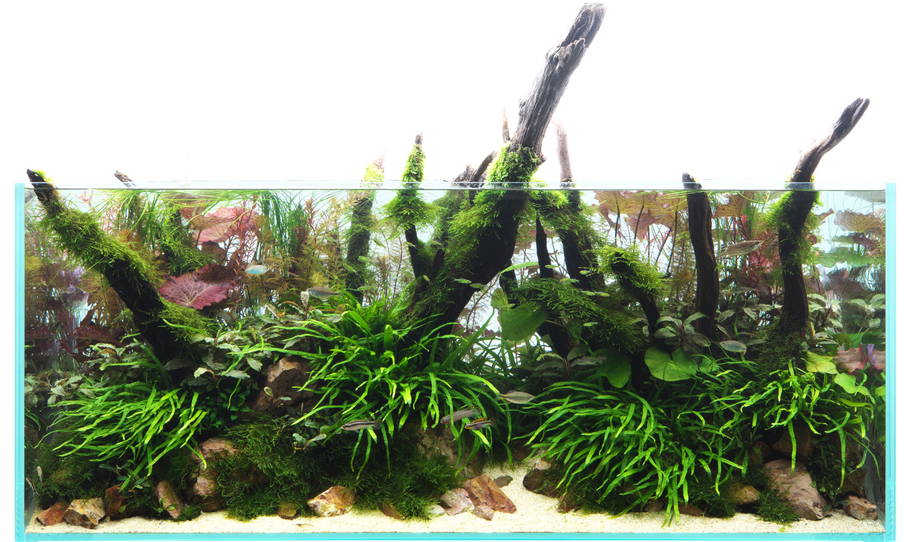

.. _sec0:

===========================
はじめに
===========================

:author: qh73xe
:Last Change: 21-May-2024.

.. contents::
    :depth: 2

.. _sec0cap1:

このパートで行うこと
===========================

- この資料で扱う内容を理解する
- Python の仮想環境を理解する
- 音声の解析に必要なライブラリをインストールする
- Web アプリケーションに必要な環境を構築する

.. _sec0cap2:

今日やること
===========================

こんにちは. 早稲田大学, 菊池研究室博士浅井です.

本日は, Open Smile についてお話をしていこうと思いますが,
その前に, 簡単な自己紹介から始めていこうかなと思います.

浅井は, 最近アクアリウムを趣味にしています.
アクアリウム皆さんご存知でしょうか？
以下の写真のようなものですね.

このアクアリウム,
生き物を飼育する趣味だと思われがちですが実は違います.
じゃあなんだと言われると, 水であるとか、光であるとか、
目に見えない要素をコントロールすることで、
望ましい, きれいな環境を作っていくゲームになります.
パラメータ設定を間違えると, 苔がでたり, 水が濁ったり, 生体が死んだりします.
逆に, 適切なパラメータ設定をすると, きれいな水景が簡単に維持できるようにもなります.

しかし水の中に溶けているものって見えないんですよね.
あるいは, 光の量や時間も操作することはできるのですが,
それが適切なのかはなかなか分かりません.
なんとかして, 目には見えないものの今の状態を知ることが重要になります.

そこで, どうするかと言うと 大きく2つ方法があります。

1 つ目の方法は水槽を良く観察するという方法です.
周囲のもの, 例えばコケの量であるとか, 中に入っている生体の状態から予測していく方法です.
経験豊富な達人になると, これが一番, 早くて正確だったりするのですけど, 
経験がないと, なかなか難しい.

2 つ目の方法は, 試験薬を使って数値で計測すると言う方法です.
有名なものを挙げれば, リトマス紙を使って pH を計測するみたいな方法です.
この方法の良いところは, 経験がなくても今の状態を把握できることです.
経験がなくとも, pH 7 となれば中性なのだとわかります.
しかし, この方法にも欠点はあります.
例えば pH は, 水に溶解している酸性物質とアルカリ性物質のどちらが多いかという指標なのですが,
これは両方多い汚い水も, 両方少ない綺麗な水も, 割合が同じなら同じ値が出でしまいます.
つまり, 測っているものが何かということをきちんと知らないと間違った判断をしてしまうのです.

今日お話しをする Open Smile は, 実はリトマス試験紙と同じようなツールです.
これは, 水の性質ではなく, 音の性質を測るツールです.
音という目に見えないものから, その特性がどのようになっているのかを
特定の指標で計測するリトマス試験紙みたいなものです.

リトマス試験紙が水につければ良いだけのように,
OpenSmile も音声に対して特定のコマンドを利用すればさまざまな指標を算出してくれます.
ただ, pH と同じように, 何を測っているものなのかを知らないと,
案外間違った判断をしてしまうこともあります.

今日のチュートリアルでは,
この音を検査する方法について解説をしていき、
時間的に可能であれば, 
実際に音声を収録して音響特徴量を算出するところまで解説できれば良いなと思います.

.. _sec0cap3:

開発環境の構築 (PYTHON 編)
=============================

このチュートリアルでは, Python 3 系を使用します.
Python 3 系をインストールしていない場合は, 以下の手順でインストールしてください::

    $ brew install python3

それが終わったらチュートリアル用のディレクトリを作成しましょう::

    $ mkdir OpenSmileTutorial
    $ cd OpenSmileTutorial

このディレクトリに対して, 仮想環境を作成します.
仮想環境とは,
あるプロジェクトに必要なライブラリをインストールするための環境です.
プロジェクトごとに必要なライブラリは変化しますし,
バージョンも異なることがあるため,
一般に, python を利用する場合,
ディレクトリごとにライブラリをインストールすることが推奨されています::

    $ python3 -m venv venv
    $ source venv/bin/activate

以後, このチュートリアルを実施する際には,
はじめに一回 `source venv/bin/activate` を実行してください.
なお, 今後の記述は全て, 仮想環境を有効にした状態で行うことを前提とします.

続いて必要なライブラリをインストールします::

    $ pip install setuptools wheel ipython # python 用インタラクティブシェル
    $ pip install numpy scipy matplotlib pandas  # 数値計算用及び可視化ライブラリ
    $ pip install pyworld  # 最も基本的な音響解析ツール. 2 章で使用.
    $ pip install opensmile  # 今回の主題である音響解析ツール. 3 章で使用.
    $ pip install pyaudio  # Mac で音声収録を行うためのライブラリ. 4 章で使用.
    $ pip install Flask  # Web サーバーアプリケーションフレームワーク. 5 章で使用.

.. note:: pyaudio のインストール.

   シリコンマックを利用する場合, 上のコマンドでは上手く行かない場合があります.
   その場合には, 以下の手順でインストールを行ってください::

       $ brew install PortAudio
       $ python3 -m pip install pyaudio --global-option="build_ext" --global-option="-I/opt/homebrew/include" --global-option="-L/opt/homebrew/lib"

.. _sec0cap4:

開発環境の構築 (TYPESCRIPT 編)
================================

これは, 主に 5 章で取り扱う内容です.
時間的に 5 章に到達しないことも考えられるので,
五章を開始した際に実施しましょう::

    $ brew install node
    $ sudo npm install -g yarn
    $ yarn create vite
    $ yarn create vite ui --template react-ts

これで, React + TypeScript のプロジェクトが作成されます.
